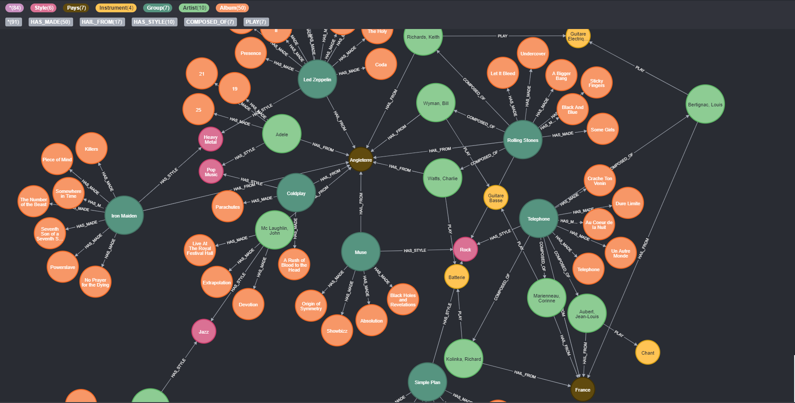

## Neo4j and Sveltekit school project

#### Feature

- [x] Paginated category (albums/artists/groups)
- [x] Simple search
- [x] Advanced search with filters
- [ ] detailed views (albums/artist/groups) (not finished)
- [ ] Add more albums/artist ?

#### Why ?

I Discovered Neo4j and I wanted to experiment more with it. The artist, albums ect really match the type of bdd that neo4j can make.

The database is Composed of 6 Labels :

- `Artist`
- `Group`
- `Album`
- `Instrument`
- `Pays`
- `Style`

and 5 relations :

- `HAS_MADE` Artist -> Album
- `HAIL_FROM` Artist -> Pays
- `HAS_STYLE` Artist -> Style
- `COMPOSED_OF` Group -> Artist
- `PLAY` Artist -> Instrument



I've separated `Groups` from `Artist` since Groups are a groups of artists.

#### Advantage

- Neo4j is really good for this types of data since we can easily track which artist did what with who via the Group node.

- Easy to comprehend what the data is about

- In a more complex scenario this can be really useful to make a really feature rich search engine for anything related to music.

- We can even implement recommendation for customers with what style, artist albums.

#### Inconvenient

- It was really hard to make bolt protocol work on free hosting platform since it uses websocket and none of those I have tired proposed it.

- There is no 'good ORM like' tools to work with in js/ts website. All tools i've tried didn't work in the webrowser, only in a node environment.
  I've tried [Neogma](https://github.com/themetalfleece/neogma), [Neode](https://github.com/adam-cowley/neode#readme), [Drivine](https://drivine.org/) but none of them worked for my case and Drivine was a bit overcomplicated for my taste.

> They might not work because sveltekit is still in early beta. I enned up using directly [neo4jdriver](https://github.com/neo4j/neo4j-javascript-driver#readme)
> and making my own [little mapper](https://github.com/Di-KaZ/NeoBum/blob/c4bf378b78082c22ec734c550b398026ecc908e4/WEB/src/neo4j.ts#L45-L52)

- I was unable to find a free hosting service for neo4j bdd it make it hard to experiment production build

### My Experience

It was really fun to experiment with new tools and I think in a larger scale taking the time to make a robust architecture for the code, Neo4j can be a really good choice for this type of project.

I wanted to make a more complex filter mechanism since it was my goal, but time was running out 😥

#### Some visuals

- Home
  

- [Album catalog](https://github.com/Di-KaZ/NeoBum/blob/c4bf378b78082c22ec734c550b398026ecc908e4/WEB/src/routes/Albums.svelte#L17-L29) + [search by filters](https://github.com/Di-KaZ/NeoBum/blob/c4bf378b78082c22ec734c550b398026ecc908e4/WEB/src/neo4j.ts#L54-L93)
  

- Detail of album and search by filter of artists and groups
  

- link to [import cypher script](https://github.com/Di-KaZ/NeoBum/blob/c4bf378b78082c22ec734c550b398026ecc908e4/BDD/cyphers/dump.cql)

## How to launch

### - The easy way with Docker

Install docker and simply run `docker-compose up` in the root directory of this repo

> The website is available on _localhost:3000_
> The Neo4j bdd is available on _localhost:7687_ via **bolt protocol**

> ⚠ Neo4j data are not permanent in neo4j container they are re-imported at each launch

### - The hard way manually

They are two part on the project :

- WEB

  Firstly you can configure the credential of nei4j in the **.env** file located in `WEB/.env`

  > The web folder is the front you can run it in **DEV MODE** by doing
  >
  > ```bash
  > yarn install # or npm install
  > yarn dev # or npm run dev
  > ```
  >
  > It will be available on _localhost:3000_

  > The web folder is the front you can run it in **PROD MODE** by doing :
  >
  > ```bash
  > yarn install # or npm install
  > yarn build # or npm run build
  > node dist/index.js
  > ```
  >
  > It will be available on _localhost:3000_.

- BDD

  > Neo4j bdd can be initialized by using the cql script located in `BDD/cyphers/`.
  > It will need to have the csv files located in `BDD/neo4j/import` in the **import** folder of your neo4j instance.
  > The just run dump.cql and the data should be imported

  > ⚠ You may need to add this line in the config of your neo4j instance
  > `dbms.default_listen_address=0.0.0.0`
